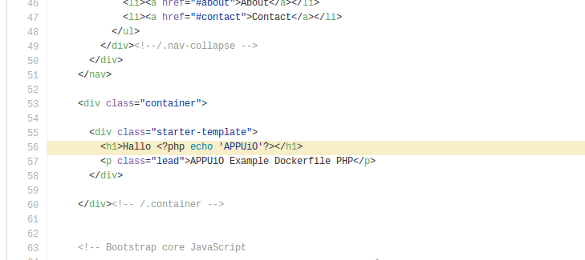

# Lab 9: Code Changes durch Webhook triggern Rebuild auf OpenShift

In diesem Lab zeigen wir den Docker Build Workflow anhand von einem Beispiel auf und Sie lernen wie Sie mit einem Push in das Git Repository einen Build und Deployment der Applikation auf OpenShift starten.

## LAB9.1: Vorbereitung Github Account und Fork

### Github Account

Damit Sie Änderungen am Source Code unserer Beispiel Applikation vornehmen können, benötigen Sie einen eigenen Git Hub Account. Richten Sie sich einen Account unter https://github.com/ ein, falls Sie nicht bereits über einen verfügen.

### Beispiel Projekt forken

**Beispiel Projekt:** https://github.com/appuio/example-php-sti-helloworld

Gehen Sie auf die [Git Hub Projekt Seite](https://github.com/appuio/example-php-sti-helloworld) und [forken](https://help.github.com/articles/fork-a-repo/) Sie das Projekt.


Sie haben nun unter nun
```
https://github.com/[YourGithubUser]/example-php-sti-helloworld
```

einen Fork des Example Projektes, den Sie so erweitern können wie sie wollen.

## Deployen des eigenen Forks

Erstellen Sie dafür ein neues Projekt
```
$ oc new-project [USER]-example3
```

Erstellen Sie für Ihren Fork eine neue App. **Note:** ersetzen Sie `[YourGithubUser]` mit dem Namen Ihres GitHub Accounts.

```
$ oc new-app https://github.com/[YourGithubUser]/example-php-docker-helloworld.git --strategy=docker --name=appuio-php-docker-ex
```

Und exposen Sie nun den Service mit 
```
$ oc expose service appuio-php-docker-ex
```

## LAB9.2: Webhook auf GitHub einrichten

Beim erstellen der App wurden in der BuildConfig direkt Webhooks definiert. Diese können Sie über den folgenden Befehl anzeigen
```
$ oc describe bc appuio-php-docker-ex

Name:			appuio-php-docker-ex
Created:		About a minute ago
Labels:			app=appuio-php-docker-ex
Annotations:		openshift.io/generated-by=OpenShiftNewApp
Latest Version:		1
Strategy:		Docker
Source Type:		Git
URL:			https://github.com/appuio/example-php-docker-helloworld.git
From Image:		ImageStreamTag openshift/php:5.6
Output to:		ImageStreamTag appuio-php-docker-ex:latest
Triggered by:		Config, ImageChange
Webhook GitHub:		https://example.com:8443/oapi/v1/namespaces/example3/buildconfigs/appuio-php-docker-ex/webhooks/_Nxh9v9jE8u6wEXfloBr/github
Webhook Generic:	https://example.com:8443/oapi/v1/namespaces/example3/buildconfigs/appuio-php-docker-ex/webhooks/fAyPWZ5vqlXQYu4HVfRB/generic

Build			Status		Duration		Creation Time
appuio-php-docker-ex-1 	running 	running for 59s 	2016-05-17 18:04:39 +0200 CEST

```

Den Github Webhook können Sie auch von der WebConsole kopieren, gehen Sie dafür via Browse --> Builds auf den entsprechenden Build und wählen Sie das Tab Configuration aus:


kopieren Sie die Webhook GitHub URL und fügen Sie auf GitHub entsprechend den [Webhook](https://developer.github.com/webhooks/) ein:

Klicken Sie in Ihrem Projekt auf Settings


Klicken Sie auf Webhooks & services


Fügen Sie einen Webhook hinzu


Fügen Sie die entsprechende GitHub Webhook Url aus Ihrem OpenShift Projek ein und "Disablen" Sie die SSL verification, auf der Lab Plattform verfügen wir nur über Self Signed Zertifikate


Ab jetzt triggern alle Pushes auf Ihr GitHub Repository einen direkt einen Build auf OpenShift und deployen anschliessend die Code Änderungen direkt auf der Plattform

## LAB9.3: Code anpassen

Klonen Sie Ihr Git Repository und wechseln Sie in das Code Verzeichnis
```
$ git clone https://github.com/[YourGithubUser]/example-php-docker-helloworld.git
$ cd example-php-docker-helloworld
```

Passen Sie das File beispielsweise auf der Zeile 56 ./app/index.php an
```
$ vim app/index.php
```



```
    <div class="container">

      <div class="starter-template">
        <h1>Hallo <?php echo 'OpenShift Techlab'?></h1>
        <p class="lead">APPUiO Example Dockerfile PHP</p>
      </div>

    </div>
```

Pushen Sie Ihren Change
```
$ git add .
$ git commit -m "updated Hello"
$ git push
```

Als Alternative können Sie das File auch direkt auf GitHub editieren:


Sobald Sie die Änderungen gepushed haben, startet OpenShift einen Build des neuen Source Codes
```
$ oc get builds
```

Und deployed anschliessend die Änderung.

## LAB9.4: Rollback

Mit OpenShift lassen sich unterschiedliche Software Stände aktivieren und deaktivieren, in dem einfach eine andere Version des Images gestartet wird.

Dafür werden die Befehle `oc rollback` und `oc deploy` verwendet.
 
Um ein Rollback auszuführen, brauchen Sie den Namen der DeploymentConfig

```
$ oc get dc

NAME                  TRIGGERS                    LATEST
appuio-php-docker-ex   ConfigChange, ImageChange   2

```

Mit dem folgenden Befehl können Sie nun ein rollback auf die vorgänger Version ausführen:

```
$ oc rollback appuio-php-docker-ex
#3 rolled back to appuio-php-docker-ex-1
Warning: the following images triggers were disabled: appuio-php-docker-ex
  You can re-enable them with: oc deploy appuio-php-docker-ex --enable-triggers -n phptest
```

Sobald das Deployment der alten Version erfolgt ist, können Sie über ihren Browser überprüfen, ob wieder die ursprüngliche Überschrift **Hello APPUiO** angezeigt wird.

**Tipp:** Die Automatischen deployments neuer Versionen ist nun für diese Applikation augeschaltet um und gewollte Änderungen nach dem rollback zu verhindern. Um das automatische Deployment wieder ein zu schalten führen Sie den folgenden Befehl aus:
 

```
$ oc deploy appuio-php-docker-ex --enable-triggers
```

---

**Ende Lab 9**

[<< zurück zur Übersicht] (../README.md)

